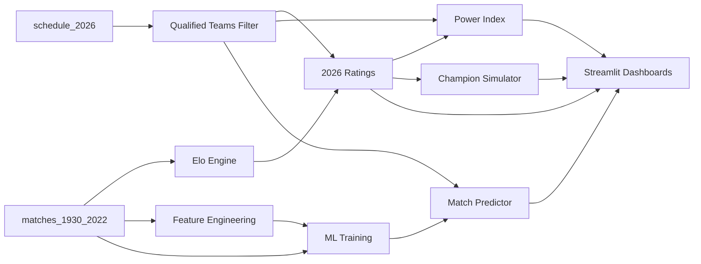

# FIFA World Cup 2026 — Analytics, Prediction & Research Platform

A flagship end-to-end sports analytics platform built on **all World Cup matches from 1930–2022**, with every user-facing output restricted to **2026-qualified teams only**.

> *Based on everything that happened in World Cup history, what can we learn and predict about the teams participating in FIFA World Cup 2026?*

## Core Constraint

| Layer | Scope |
|-------|-------|
| **Training / Elo / Features** | All historical data (1930–2022) |
| **Rankings / Predictions / Dashboards** | 2026-qualified teams only |

Historical teams not in the 2026 tournament are background data — they never appear in final outputs.

## Architecture

```
data/                          # Raw datasets
├── matches_1930_2022.csv      # 900+ WC match records
├── schedule_2026.csv          # 2026 fixtures (source of truth for qualified teams)
├── fifa_ranking_2026-06-08.csv
└── world_cup.csv

utils/
├── config.py                  # Paths & hyperparameters
├── data_loader.py             # Ingestion & cleaning
├── team_standardizer.py       # Name normalization (West Germany → Germany, etc.)
├── qualified_teams_2026.py    # 2026 team filter (from schedule)
├── elo_engine.py              # Elo ratings over full history
├── power_index.py             # Composite ranking (Elo + FIFA + WC stats)
├── feature_engineering.py     # ML feature pipeline
└── analytics.py               # Cached pipeline entry point

models/
├── match_predictor.py         # Gradient Boosting classifier
├── champion_predictor.py      # Monte Carlo championship odds
└── tournament_simulator.py    # Knockout simulation + upset tracking

pages/                         # Streamlit multi-page app
├── Home.py
├── Elo_Dashboard.py
├── Power_Rankings.py
├── Match_Predictor.py
├── Champion_Predictor.py
├── Tournament_Simulator.py
├── Team_Explorer.py
├── Historical_Research.py
├── Upset_Analysis.py
└── Explainable_AI.py
```

## Quick Start

```bash
pip install -r requirements.txt
streamlit run app.py
```

## Modules

| Module | What it does |
|--------|--------------|
| **Elo Dashboard** | Dynamic Elo from full history, displayed for 48× 2026 teams |
| **Power Rankings** | Weighted composite: Elo (40%) + FIFA (30%) + WC wins (15%) + appearances (10%) + form (5%) |
| **Match Predictor** | ML model predicting head-to-head outcomes between 2026 teams |
| **Champion Predictor** | 10K Monte Carlo simulations → championship probabilities |
| **Tournament Simulator** | Full knockout bracket simulation with upset tracking |
| **Team Explorer** | Per-team WC history, stats, and ratings |
| **Historical Research** | Tournament trends contextualized for 2026 participants |
| **Upset Analysis** | Underdog win patterns for 2026 teams |
| **Explainable AI** | Feature importance + SHAP for match predictions |

## Data Flow



## 2026 Team Filter

The filter is enforced centrally in `utils/qualified_teams_2026.py`:

- Teams are derived from `schedule_2026.csv` (48 teams)
- `filter_2026_teams()` / `restrict_team_list()` gate all user-facing outputs
- Models train on all history; predictions only between 2026 teams

## License

Portfolio / educational project.
